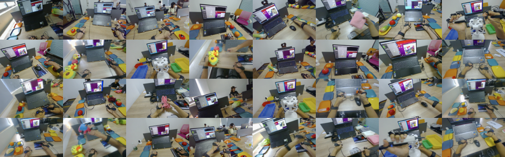

# CYBER: A General Robotic Operation System for Embodied AI



The development of world models in robotics has long been a cornerstone of advanced research, with most approaches relying heavily on vast, platform-specific datasets. These datasets, while valuable, often limit scalability and generalization to different robotic platforms, restricting their broader applicability.

In contrast, **CYBER** approaches world modeling from a "first principles" perspective, drawing inspiration from how humans naturally acquire skills through experience and interaction with their environment. **CYBER** is the first general Robotic Operational System designed to adapt to both tele-operated manipulation and human operation data, enabling robots to learn and predict across a wide range of tasks and environments. It build with a <u>Physical World Model</u>, a cross-embodied <u>Visual-Language Action Model</u> (VLA), a <u>Perception Model</u>, a <u>Memory Model</u>, and a <u>Control Model</u> to help robots learn, predict, and memroy across various tasks and embodiments.

At the same time, **CYBER** also provide millions of human operation datasets and baseline models over HuggingFace 🤗 to enhance embodied learning, and experimental evalaution tool box to help researchers to test and evaluate their models in both simulation and real world.

---

## 🌟 Key Features

- **🛠️ Modular**: Built with a modular architecture, allowing flexibility in various environments.
- **📊 Data-Driven**: Leverages millions of human operation datasets to enhance embodied learning.
- **📈 Scalable**: Scales across different robotic platforms, adapting to new environments and tasks.
- **🔧 Customizable**: Allows for customization and fine-tuning to meet specific requirements.
- **📚 Extensible**: Supports the addition of new modules and functionalities, enhancing capabilities.
- **📦 Open Source**: Open-source and freely available, fostering collaboration and innovation.
- **🔬 Experimental**: Supports experimentation and testing, enabling continuous improvement.
---

## 🛠️ Modular Components

**CYBER** is built with a modular architecture, allowing for flexibility and customization. Here are the key components:

- [**🌍 World Model**](docs/tutorial/world.md): Learns from physical interactions to understand and predict the environment.
- [**🎬 Action Model**](docs/tutorial/action.md): Learns from actions and interactions to perform tasks and navigate.
- [**👁️ Perception Model**](docs/tutorial/preception.md): Processes sensory inputs to perceive and interpret surroundings.
- [**🧠 Memory Model**](docs/tutorial/memory.md): Utilizes past experiences to inform current decisions.
- [**🎮 Control Model**](docs/tutorial/control.md): Manages control inputs for movement and interaction.

## ⚙️ Setup

### Pre-requisites

You will need Anaconda installed on your machine. If you don't have it installed, you can follow the installation instructions [here](https://docs.anaconda.com/anaconda/install/linux/).

### Installation

You can run the following commands to install CYBER:

```bash
bash scripts/build.sh
```

Alternatively, you can install it manually by following the steps below:

1. **Create a clean conda environment:**

        conda create -n cyber python=3.10 && conda activate cyber

2. **Install PyTorch and torchvision:**

        conda install pytorch==2.3.0 torchvision==0.18.0 cudatoolkit=11.1 -c pytorch -c nvidia

3. **Install the CYBER package:**

        pip install -e .

## 🤗 Hugging Face Integration

**CYBER** leverages the power of Hugging Face for model sharing and collaboration. You can easily access and use our models through the Hugging Face platform.

### Available Data

Currently, four tasks are avaible for download:

- 🤗 [Pipette](https://huggingface.co/datasets/cyberorigin/cyber_pipette)
- 🤗 [Take Item](https://huggingface.co/datasets/cyberorigin/cyber_take_the_item)
- 🤗 [Twist Tube](https://huggingface.co/datasets/cyberorigin/cyber_twist_the_tube)
- 🤗 [Fold Towels](https://huggingface.co/datasets/cyberorigin/cyber_fold_towels)

### Available Models

Our pretrained models will be released on Hugging Face soon:

- [Cyber-World-Large](https://huggingface.co/cyberorigin/cyber-xlarge)
- [Cyber-World-Base](https://huggingface.co/cyberorigin/cyber-large)
- [Cyber-World-Small](https://huggingface.co/cyberorigin/cyber-base)

### Using the Models

To use our models in your project, you can install the `transformers` library and load the models as follows:

```python
from transformers import AutoModel, AutoTokenizer

# Load the tokenizer and model
tokenizer = AutoTokenizer.from_pretrained("cyberorigin/cyber-base")
model = AutoModel.from_pretrained("cyberorigin/cyber-base")

# Example usage
inputs = tokenizer("Hello, world!", return_tensors="pt")
outputs = model(**inputs)
```

For more details, please refer to the [Hugging Face documentation](https://huggingface.co/docs/transformers/index).


## 🕹️ Usage

Please refer to the [experiments](experiments/README.md) for more details on data downloading and model training.

---

## 💾 File Structure

```plaintext
├── ...
├── docs                   # documentation files and figures 
├── docker                 # docker files for containerization
├── examples               # example code snippets
├── tests                  # test cases and scripts
├── scripts                # scripts for setup and utilities
├── experiments            # model implementation and details
│   ├── configs            # model configurations
│   ├── models             # model training and evaluation scripts
│   ├── notebooks          # sample notebooks
│   └── ...
├── cyber                  # compression, model training, and dataset source code
│   ├── dataset            # dataset processing and loading
│   ├── utils              # utility functions
│   └── models             # model definitions and architectures
│       ├── action         # visual language action model
│       ├── control        # robot platform control model
│       ├── memory         # lifelong memory model
│       ├── perception     # perception and scene understanding model
│       ├── world          # physical world model
│       └── ...
└── ...
```

### 📕 References

Magvit2 and GENIE adapted from [1xGPT challege](https://github.com/1x-technologies/1xgpt)
1X Technologies. (2024). 1X World Model Challenge (Version 1.1) [Data set]

- [MetaSLAM Github](https://github.com/MetaSLAM)
- [MetaSLAM website](https://metaslam.github.io/)

```bibtex
@inproceedings{wang2024hpt,
author    = {Lirui Wang, Xinlei Chen, Jialiang Zhao, Kaiming He},
title     = {Scaling Proprioceptive-Visual Learning with Heterogeneous Pre-trained Transformers},
booktitle = {Neurips},
year      = {2024}
}
```

```bibtex
@inproceedings{wang2024hpt,
author    = {Lirui Wang, Xinlei Chen, Jialiang Zhao, Kaiming He},
title     = {Scaling Proprioceptive-Visual Learning with Heterogeneous Pre-trained Transformers},
booktitle = {Neurips},
year      = {2024}
}
```

## Contact
If you have technical questions, please open a GitHub issue. For business development or other collaboration inquiries, feel free to contact us through email 📧 (<contact@cyberorigin.ai>). Enjoy! 🎉
